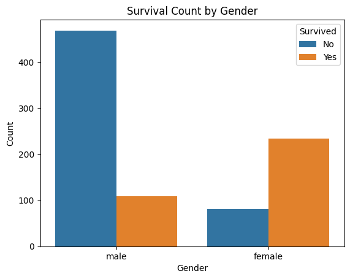
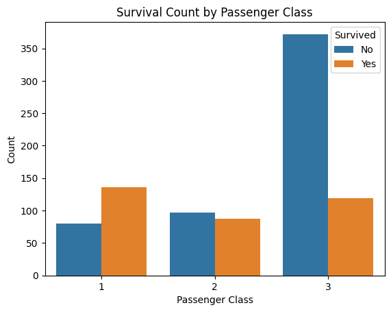
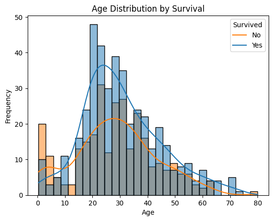

# Titanic Survival Prediction

This project analyzes the Titanic dataset to build machine learning models that predict passenger survival. It demonstrates a complete data science workflow including data preprocessing, exploratory data analysis (EDA), feature engineering, model training, evaluation, and final prediction.

---

## Project Overview

- **Goal:** Predict which passengers survived the Titanic disaster.
- **Dataset:** [Kaggle Titanic Dataset](https://www.kaggle.com/competitions/titanic/data)
- **Techniques Used:** Logistic Regression, Random Forest, Feature Engineering, EDA

---

## Key Steps

### 1. Exploratory Data Analysis (EDA)
- Survival count by gender  
  

- Survival count by passenger class  
  

- Age distribution by survival  
  

### 2. Data Preprocessing
- Encoded categorical variables (`Sex`, `Embarked`)
- Handled missing values in `Age`, `Fare`, and `Embarked`
- Dropped non-informative features: `Cabin`, `Ticket`, `Name`

### 3. Model Training
- **Logistic Regression:** Achieved ~80.45% validation accuracy
- **Random Forest Classifier:** Improved accuracy to ~83.80%
- Removed `PassengerId` to avoid model leakage

### 4. Final Predictions
- Made predictions on test dataset using Random Forest
- Exported final results to `titanic_submission.csv`

---

## Feature Importance

**Logistic Regression:**  
- Most influential features: `Sex`, `Pclass`, `Embarked_S`

**Random Forest:**  
- Most influential features: `Sex`, `Fare`, `Age`

---

## Technologies Used

- Python
- pandas, numpy
- seaborn, matplotlib
- scikit-learn
- Google Colab

---

## 📁 Repository Structure

```
📦 Titanic_Prediction_Model/
 ┣ 📂 images/
 ┃ ┣ 📄 age_distribution.png
 ┃ ┣ 📄 survival_by_gender.png
 ┃ ┗ 📄 survival_by_pclass.png
 ┣ 📄 Titanic_Prediction_Model_Final.ipynb
 ┣ 📄 titanic_submission.csv
 ┣ 📄 README.md
 ┣ 📄 requirements.txt
 ┗ 📄 LICENSE
```

---

## Author

Project by **Christos Papakostas**  
[LinkedIn Profile](https://www.linkedin.com/in/christos-papakostas/)

---

## Contact

Feel free to reach out if you want to collaborate or have feedback on this project!
